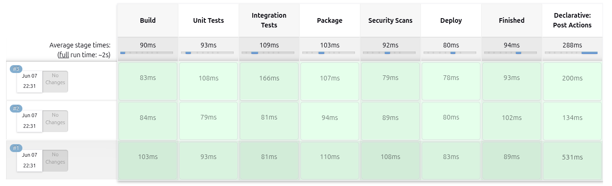
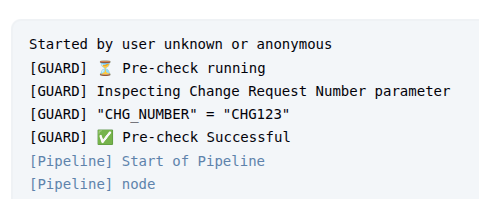
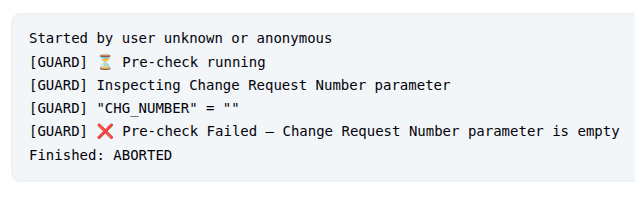
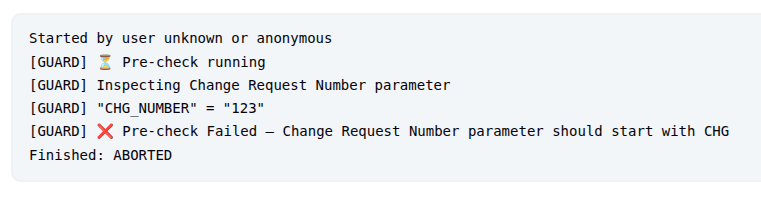
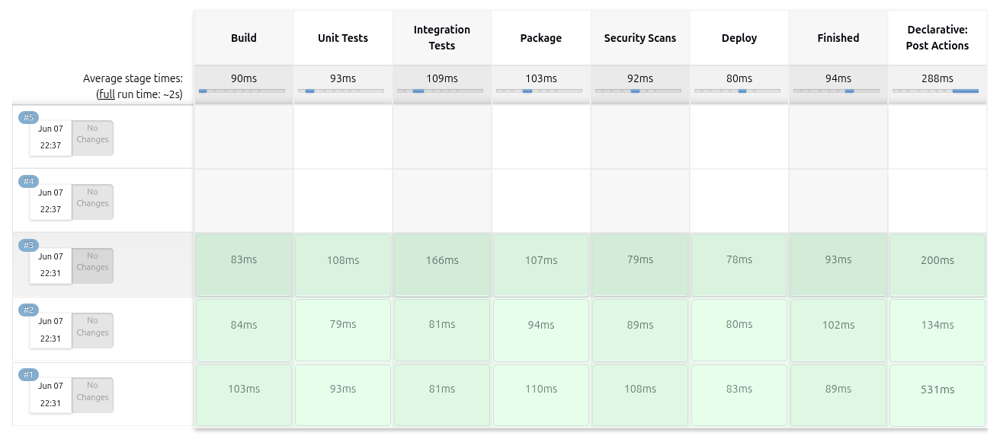

# Jenkins Guard Plugin Sample

## Introduction

This Jenkins plugin serves as a guard that executes before and after any job execution. It can be used to implement
pre-checks and post-checks for Jenkins jobs.

## Features

- Executes before and after Pipeline job execution
- Executes before and after Freestyle project execution
- Executes before and after Maven project execution (if Maven plugin is installed)
- Fails jobs with a custom message during pre-check phase
- Logs job result during post-check phase

## Demo

Plugin will execute Pre- and Post-Checks when executing any Jenkins Job.

Consider the below pipeline:



When `jenkins-plugin-guard-sample` is installed, each pipeline execution will result with pre- and post-checks
execution:




When checks are failing:

Example 1:



Example 2:



Then pipeline execution is aborted:



## Usage

### Build

To build the plugin, run:

```shell
mvn clean install
```

### Run under Jenkins using Maven

To run the plugin under Jenkins, using Maven, execute:

```shell
mvn hpi:run
```

### Run under Jenkins using Docker Compose

1. Checkout https://github.com/dominikcebula/jenkins-docker-compose
2. Copy `target/jenkins-plugin-guard-sample.hpi` to `local-plugins` folder under `jenkins-docker-compose`.
3. Run Jenkins using instructions under https://github.com/dominikcebula/jenkins-docker-compose

## Author

Dominik Cebula

* https://dominikcebula.com/
* https://blog.dominikcebula.com/
* https://www.udemy.com/user/dominik-cebula/
