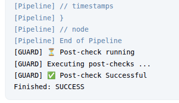

[](https://github.com/dominikcebula/jenkins-plugin-guard-sample/actions/workflows/maven.yml)

# Jenkins Guard Plugin Sample

## Introduction

This Jenkins plugin acts as a security guard that executes before and after any job execution. It provides a framework
for implementing
pre-checks and post-checks for all Jenkins jobs, helping to enforce organizational policies and standards.

## Features

- Executes before and after Pipeline job execution
- Executes before and after Freestyle project execution
- Executes before and after Maven project execution (when Maven plugin is installed)
- Fails jobs with custom messages during the pre-check phase
- Logs job results during the post-check phase

## Demo

The plugin automatically executes Pre- and Post-Checks whenever any Jenkins Job runs.

Here's an example pipeline:


When the `jenkins-plugin-guard-sample` is installed, each pipeline execution includes pre- and post-checks:




When checks fail, you'll see error messages like these:

Example 1:


Example 2:


In these cases, the pipeline execution is automatically aborted:


## Usage

### Build

To build the plugin, run:

```shell
mvn clean install
```

### Run in Jenkins using Maven

To run the plugin in a local Jenkins instance using Maven, execute:

```shell
mvn hpi:run
```

### Run in Jenkins using Docker Compose

1. Clone the repository: `git clone https://github.com/dominikcebula/jenkins-docker-compose`
2. Copy `target/jenkins-plugin-guard-sample.hpi` to the `local-plugins` folder in the `jenkins-docker-compose` directory
3. Start Jenkins using the instructions provided at https://github.com/dominikcebula/jenkins-docker-compose

## Author

Dominik Cebula

* https://dominikcebula.com/
* https://blog.dominikcebula.com/
* https://www.udemy.com/user/dominik-cebula/
